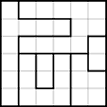
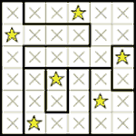

# Puzzle Solvers

A collection of solvers for many puzzles that I've written over the years. I've found that solving puzzles is a great way to teach myself new techniques from the combinatorial optimization field, and in fact I have used many of them in my actual job as a software engineer.

For extra motivation of why should anyone spend time programming puzzles, I recommend the article "Are Toy Problems Useful?", written by Donald Knuth (and reprinted in [Selected Papers on Computer Science](https://www.amazon.com/Selected-Papers-Computer-Science-Lecture/dp/1881526917)).

Almost all puzzles here can be played online on the wonderful site [janko](https://www.janko.at/Raetsel/index.htm).

The methods used to solve the puzzles so far:
* **Exact cover**: an implementation of Knuth's Dancing Links algorithm.
* **Constraint programming**: A small library I wrote, allowing for arbitrary constraints, and falling back to backtracking when no information can be extracted by manipulating the constraints.
* **Mixed integer programming**: Programming MIP from scratch is hard, so instead I wrote an easy-to-use C++ frontend to the external library SCIP.

## Akari (Light Up)

Rules:
* Place light bulbs on the board in a way every cell in the board gets illuminated.
* Each light bulb shines its entire row and column, unless blocked by a black cell.
* No light bulbs can shine another light bulb.
* Cells numbered indicate the number of adjacent light bulbs (diagonals doesn't count).

 

## Takuzu (Binairo, 0hh1)

Rules:
* Each row and column must have the same number of 0 and 1.
* You can't place more than two of the same number adjacent to each other.
* All rows and columns must be unique.

 

## Star batlle (Dopplestern, Sternenschlacht)

Rules:
* Every row, column and group must have the same number of stars (the number is given, usually one or two).
* Stars can't touch each other, not even on diagonals.

 

## Hashiwokakero (Bridges)

Rules:
* Connect all islands with bridges.
* Bridges must be horizontal or vertical.
* Bridges can't cross each other.
* Islands can be connected by one or two bridges.
* The number on the island is the number of bridges connected to it.
* All islands must be connected in a single group.

 

