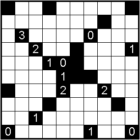
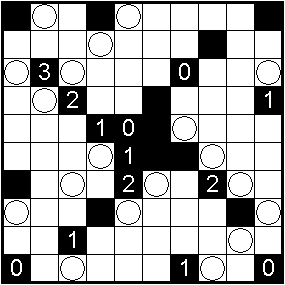
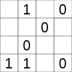
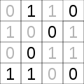
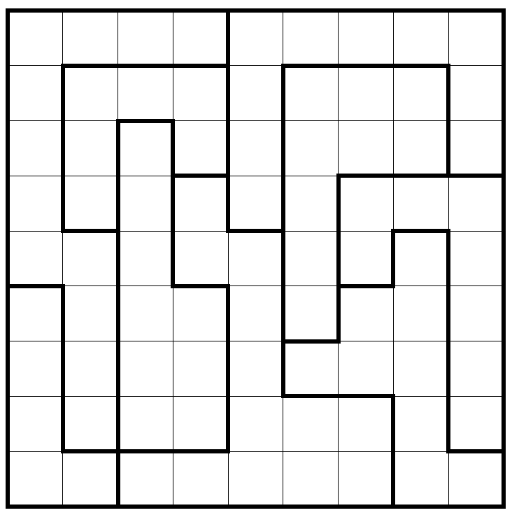
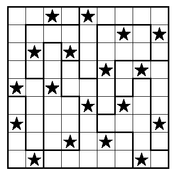

# Puzzle Solvers

A collection of solvers for many puzzles that I've written over the years. I've found that solving puzzles is a great way to teach myself new techniques from the combinatorial optimization field, and in fact I have used many of them in my actual job as a software engineer.

The puzzles I like to solve appear in many magazines around the world, such as Nikoli (Japan), Denksel (German), Multilogic (France). Those are the ones I solved so far:

## Akari (Light Up)

Rules:
* Place light bulbs on the board in a way every cell in the board gets illuminated.
* Each light bulb shines its entire row and column, unless blocked by a black cell.
* No light bulbs can shine another light bulb.
* Cells numbered indicate the number of adjacent light bulbs (diagonals doesn't count).

 

## Takuzu (Binairo, 0hh1)

Rules:
* Each row and column must have the same number of 0 and 1.
* You can't place more than two of the same number adjacent to each other.
* All rows and columns must be unique.

 

## Star batlle (Dopplestern)

Rules:
* Every row, column and group must have two stars.
* Stars can't touch each other, not even on diagonals.

 

